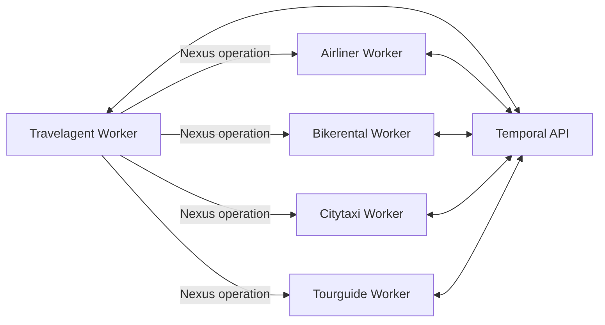

# Global Travel Agency - a Temporal.io example

[](https://github.com/emicklei/temporal-global-travel-agency/actions/workflows/ci-tests-coverage.yml)

## Structure

- `apps/`: application projects
- `apis/`: API contracts and schemas
- `pkgs/`: shared reusable packages
- `pkgs/apis`: contains (generated) classes for API access
- `scripts/` : tools for local development

## Architecture



## Setup

This is a Python monorepo scaffolded with `uv` and `pants`.
In order to develop or run, you need to setup the tool for either [Windows](docs/setup_windows.md) or [Mac](docs/setup_mac.md).

## App Commands

Each app has its own Makefile at `apps/<app name>/Makefile`.

For example, from `apps/airliner`:

```bash
make run
make check
make test
make docker-build
make docker-run
```

## Locally run a `JourneyWorkflow`.

1. start temporal server (in a separate terminal).

```bash
temporal server start-dev
```

View the Temporal UI

```bash
open http://localhost:8233
```

2. create namespaces ; each app has its own.

```bash
make setup-namespaces
```

3. create Temporal Nexus endpoints.

```bash
make setup-nexus-endpoints
```
4. start the airliner (in a separate terminal).

```bash
cd apps/airliner && make run
```

Last log statement is : Airliner worker started.

5. start the travelagent (in a separate terminal).

```bash
cd apps/travelagent && make run
```

Last log statement is : TravelAgent worker started.

6. start a Journey workflow using a `Journey` input JSON document.

```bash
cd apps/travelagent && make start
```

Select the namespace `travelagent` in the UI and inspect the completed Workflow.

## Run All Tests

From the root of the repository:

```bash
PYTHON=python3.9 ./pants test ::
```

or simply:

```bash
./pants test ::
```

## Format All

Run repository-wide formatting hooks from the root:

```bash
make fmt
```

## Run Changed Tests

Run only tests affected by changes compared to `origin/main`:

```bash
PYTHON=python3.9 ./pants --changed-since=origin/main --changed-dependents=transitive test
```

## Pre-commit Hook: Tag Validation

This repository includes a local `pre-commit` hook that validates git tags follow:

```text
apps/<folder>/vX.Y.Z
```

Rules:

- `<folder>` must exist under `apps/`
- `X`, `Y`, and `Z` must be non-negative integers (`>= 0`)

Install and run:

```bash
uv run pre-commit install
uv run pre-commit run --all-files
```

## API Schema Validation

All JSON schema files under `apis/` are validated by:

- a local `pre-commit` hook (`validate-api-schemas`)
- the CI workflow (`Validate API JSON schemas` step)

For `apis/travelagent/v1/journey.schema.json`, each route `schema_version` must
match `<string>/v<integer>(.<integer>)*`, for example:

- `airliner/v1`
- `bikerental/v1.2`
- `citytaxi/v2.0`

Run manually from the repository root:

```bash
bash scripts/validate_api_schemas.sh
```

## API Model Generation

Generate Python Pydantic models for all schema files under `apis/`:

```bash
make gen
```

Generated files are written to `pkgs/apis/<domain>/<version>/`.
The `apis/` tree is schema-only and must not contain Python model files.
Generated files are committed to the repository and must stay in sync with schemas.

To verify generated models are up to date:

```bash
bash scripts/generate_api_models.sh
git diff --exit-code -- pkgs/apis
```

The same generated-model sync check runs in pre-commit and CI.

Model files are generated with `codeberg.org/emicklei/schema2py` and include strict Pydantic validation behavior
as defined by each schema.

## Sparse checkouts
A monorepo will naturally grow quite large quite fast and for many reasons engineers will for the
most time prefer to only have a subset of the tree checked out at once. Git *sparse checkouts* provides
a mechanism for archieving this.

Executing:
```bash
git config core.sparseCheckout true
echo '/*'           >  .git/info/sparse-checkout
echo '!/apps/*'     >> .git/info/sparse-checkout
echo '/apps/travelagent/*' >> .git/info/sparse-checkout
```
enables sparse checkouts and configures git to checkout the the whole tree except all apps other
than `travelagent`. To make it happen, either run a checkout command or to update the work tree in-place:
```
git read-tree -mu HEAD
```
