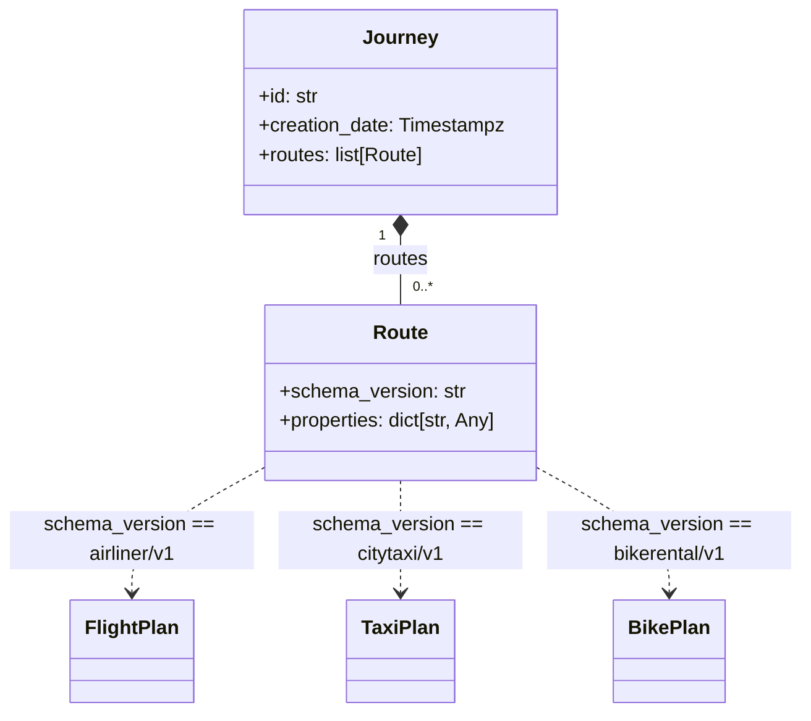

# travelagent

Travelagent application using Temporal Python SDK with an example workflow for travel planning.

## Workflows

### JourneyWorkflow
A workflow that accepts a `Journey` object (with routes and travel details) and prints it as formatted JSON to the console. This demonstrates how to work with complex typed input objects in Temporal workflows.

## Journey And Route Type Relations

`Journey` contains a list of `Route` entries. Each `Route` carries a `schema_version` and `properties`. In `JourneyWorkflow`, `schema_version` determines which plan model is constructed from `properties`.



## Commands

From this directory:

```bash
make run
make test
make docker-build
make docker-run
```

## Local Temporal Server

The worker defaults to `localhost:7233` and namespace `default`.
Start a local Temporal dev server in another terminal if needed:

```bash
temporal server start-dev
```
